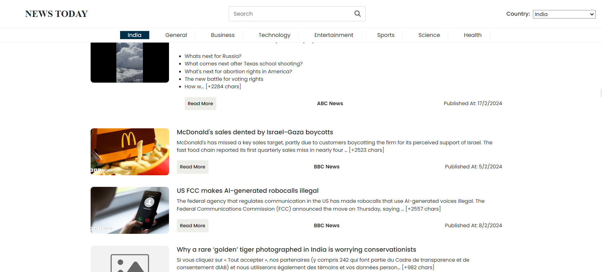
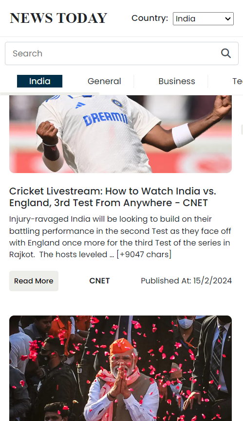

# News Today Web Application

The "News Today" web application allows users to browse and read news articles from various categories and countries. Here's an overview of its features, design, and implementation:

Teachnologies used: HTML, CSS, Javascript
## Features

1. **Search**: Users can search for specific news articles using the search bar.
2. **Country Selection**: Users can select their country to view top headlines from that country.
3. **Article Categories**: Users can browse news articles based on different categories such as General, Business, Technology, Entertainment, Sports, Science, and Health.
4. **Responsive Design**: The web application is designed to be responsive, providing a seamless experience across different devices.

## Design

- **Typography**: The website uses serif and sans-serif fonts for a classic and modern look.
- **Color Scheme**: The color scheme includes shades of black, white, and blue, providing a clean and professional appearance.
- **Layout**: The layout is structured with navigation at the top, followed by search and country selection options. News articles are displayed in a grid format below these sections.

## Responsive Design

  
Mobile Device

  
Desktop Device

  

## Implementation

- **API Integration**: The application integrates with the News API to fetch real-time news data based on user interactions.
- **Dynamic Content**: News articles are dynamically generated and displayed on the webpage based on user actions such as country selection and category selection.
- **Error Handling**: Error messages are displayed to users in case of any issues with fetching news data.
- **Event Handling**: Various user interactions such as clicking on news categories and search are handled using event listeners to trigger appropriate actions.
